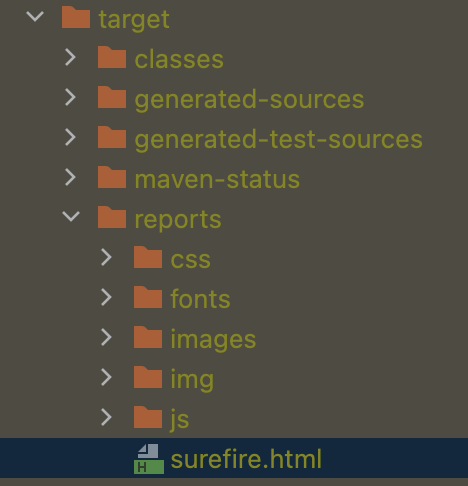

### Tests E2E avec Selenium

1. Revoir les bases de Java.
2. Comment utiliser Selenium.
3. Automatiser un site web.
4. Réaliser des tests automatisés efficaces.

### Pour lancer un test avec génération de rapport html via le plugin surefire
Entrer la commande suivante :

```
mvn surefire-report:report -Dtest=org.example.sauce_demo.CartOrderTest
```

Le rapport généré se trouve dans le répertoire "target/reports" :


